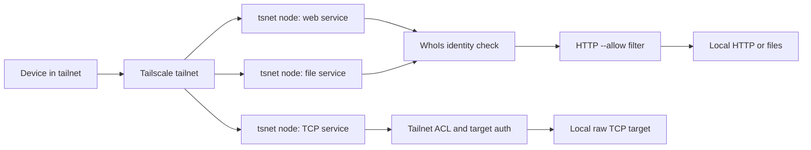

# TSLink

Give a local web app, file, or TCP service its own Tailscale node and tailnet name.

[](LICENSE)
[](go.mod)
[
](https://github.com/anydoor7/tslink)

[中文](README_zh.md) · [GitHub](https://github.com/anydoor7/tslink)

[Why TSLink](#why-tslink) · [Quick start](#quick-start) · [Features](#features) ·
[How it works](#how-it-works) · [Security](#security-model) · [Agents](#for-ai-agents) ·
[Commands](#commands) · [Docs](#documentation)

## Why TSLink

A local service needs an address that other devices can reach.
Opening a router port makes the service reachable from the internet; a hosted tunnel routes
requests through its provider.
Tailscale provides private device connectivity, while a separate hostname and access rule for each
local service still take setup work.

| Approach | Who sets it up | Traffic path | Identity per service | Access per service |
|---|---|---|---|---|
| Port forwarding | Router operator | Public internet to router | Port or domain mapping | Firewall and application |
| [ngrok](https://ngrok.com/use-cases/share-localhost) | ngrok account holder | ngrok cloud and tunnel | Endpoint URL | Traffic Policy or application |
| [Cloudflare Tunnel](https://developers.cloudflare.com/tunnel/concepts/routing/) | Cloudflare account and connector operator | Cloudflare network and tunnel | Published hostname | Cloudflare Access or application |
| [Tailscale Services](https://tailscale.com/docs/features/tailscale-services) | Tailnet admin; host approval or auto-approval | Tailnet, direct or encrypted relay | Service name | Tailnet grants or ACLs |
| TSLink | Local user with a tailnet account | Tailnet, direct or encrypted relay | One [tsnet](https://tailscale.com/docs/features/tsnet) node per service | HTTP `--allow`; tailnet ACLs for TCP |

TSLink uses [tsnet](https://tailscale.com/docs/features/tsnet) for each service. Its first run can
enroll user-owned nodes without a stored administrator credential.
[Tailscale Services](https://tailscale.com/docs/features/tailscale-services) remain a native route
when the tailnet administrator wants to define, approve, and govern services centrally.

Tailscale may carry encrypted tailnet transport through a
[DERP relay](https://tailscale.com/docs/reference/derp-servers) when a direct path is unavailable.
Explicit `--funnel --public` can expose an HTTP proxy to the public internet.

## Quick start

There is no public tag or populated Homebrew tap yet. Install from source today with Go 1.26.6 or
newer. The binary goes in `$(go env GOPATH)/bin`; add that directory to `PATH` if needed.

```bash
git clone https://github.com/anydoor7/tslink.git
cd tslink
go install .
tslink share ./build
tslink add myapp --proxy localhost:3000
```

`share` prints an enrollment URL on first use. Open it to authorize the node, then run
`tslink url <name> --wait` if the service URL is still pending. `add` registers a named service
and starts the background service when its supervisor is available. See
[getting started](docs/getting-started.md) and [daemon lifecycle](docs/daemon-lifecycle.md) for
other paths.

## Features

### Publishing

- `share` accepts a file, directory, bare port, or `host:port` and prints one URL.
- `add` registers HTTP proxy, file directory, and raw TCP services under separate node identities.
- HTTP proxy and file services use Tailscale HTTPS listeners. TCP forwards a private byte stream.
- Funnel exposure requires `--funnel --public`; ordinary services remain inside the tailnet.

### Access control

- `--allow` filters HTTP proxy and file requests by Tailscale login or tag.
- Raw TCP uses tailnet policy and the target application's authentication.
- Each service has a separate node, hostname, and network identity.
- `access explain`, `status --urls`, and `doctor` show local evidence and unknown external layers.

### Agents and MCP

- `tslink mcp` serves local tools to an MCP client over stdio.
- `tslink serve --mcp` can expose the same tools on a dedicated tailnet node when `mcp.allow` is
  configured.
- `--json` provides a versioned result envelope for CLI automation.
- Built-in templates can be previewed before applying missing services.

### Operations

- Registry changes take effect while the daemon runs.
- `install` sets up user-level supervision on macOS, Linux, or Windows with platform-specific
  restart behavior.
- Tier 1 enrolls user-owned nodes without storing a credential. Tier 2 enables tagged,
  credentialed installations.
- Local diagnostic and cleanup commands report what was checked before changing remote state.

## How it works



Each registered service runs as its own tsnet node. HTTP proxy and file paths verify WhoIs before
using the `--allow` list. Raw TCP has no TSLink HTTP identity filter; its protection comes from
the tailnet policy and target service. [Architecture details](docs/architecture.md).

## Security model

How TSLink maps onto common zero-trust principles:

| Zero-Trust Principle | TSLink Implementation |
|-----|-----|
| **HTTP caller verification** | Tailnet HTTP proxy/file requests can be authenticated via Tailscale WhoIs. The proxy strips client-supplied `Tailscale-*` and `X-Tailscale-*` identity headers, including underscore variants, before injecting `X-Tailscale-User-Login`, `X-Tailscale-User-Name`, `X-Tailscale-User-Picture`, and `X-Tailscale-Node` only when WhoIs succeeds. Public Funnel exposure and raw TCP streams are not treated as TSLink-enforced Tailscale user authentication. |
| **HTTP least-privilege access** | `--allow` restricts proxy and file services to specific users or tags. TCP services rely on Tailscale network ACLs and tags. |
| **Assume breach** | Tailnet device-to-device traffic uses WireGuard encryption. Even if your local network is compromised, traffic between your Tailscale devices remains encrypted; public Funnel paths follow Tailscale Funnel semantics. |
| **Per-service network identity** | Each service runs as a separate tsnet node with its own hostname and network identity. This is network segmentation, not host process isolation or a compliance attestation. |
| **No implicit trust** | No services are exposed to the public internet by default. The default first run uses Tailscale interactive enrollment with no stored administrative credential, no advertised tags, and no ACL edits. Optional durable-install credentials use the system keychain first; macOS/Linux file fallback requires proof that no stale keychain credential remains. |

Proxy and TCP registration refuses literal link-local and unspecified addresses,
known cloud-metadata targets, and numeric respellings of refused IPv4 addresses.
Loopback shorthand such as `127.1` is accepted. Target validation does not
resolve DNS or check the resolved address when connecting.

This is a design mapping, not a formal attestation. TSLink claims no compliance status; the
machine-readable manifest is
[`internal/security/capabilities.v1.json`](./internal/security/capabilities.v1.json), and every
capability in it records its compliance status explicitly.

## For AI agents

Point a local MCP client at the installed command:

```json
{
  "mcpServers": {
    "tslink": {
      "command": "tslink",
      "args": ["mcp"]
    }
  }
}
```

The local MCP process opens no network listener. A tool call can start the separate TSLink daemon
to publish a service. For a client on another tailnet device, configure the remote control plane
and `mcp.allow`; see [remote MCP](docs/remote-mcp.md) and [MCP client setup](docs/mcp-clients.md)
.

| | `tslink mcp` | `tslink serve --mcp` |
|---|---|---|
| Transport | stdio, newline-delimited JSON-RPC | Streamable HTTP at `https://<node>.<tailnet>.ts.net/mcp` |
| Network listener | None | TLS listener on a dedicated tsnet node, tailnet-only |
| Authorization | The local user who launched it | `mcp.allow` login emails and/or `tag:` entries, mandatory |
| Configuration | None | `--mcp` or `mcp.enabled`, plus `mcp.allow` in `config.json` |
| Tools | 19 | The same 19, from one tool registry |
| Typical client | An MCP client on this machine | An MCP client on another machine in the tailnet |

The remote node stays tailnet-only. Its authorized callers can add and remove services, expose a
proxy through Funnel, and manage invitations. Grant `mcp.allow` with those actions in mind.

## Commands

| Command | Description |
|---------|-------------|
| `tslink login` | Store an optional Tier 2 API access token or OAuth client secret |
| `tslink logout` | Clear credentials from keychain and files |
| `tslink add <name> --proxy host:port` | Expose a local web service |
| `tslink add <name> --dir /path` | Expose a file directory |
| `tslink add <name> --tcp host:port` | Expose a raw TCP service (databases, SSH, etc.) |
| `tslink remove <name>` | Remove a service and report protected/manual remote cleanup guidance |
| `tslink list` | List the services registered on this machine |
| `tslink list --tailnet` | Read-only: list every TSLink-tagged device in the whole tailnet, including other machines' services and orphans (requires a stored API credential) |
| `tslink share <path\|port\|host:port>` | Share a local path or web port and print its tailnet URL |
| `tslink url <name>` | Print one service's exact runtime URL |
| `tslink cleanup` | Reconcile expired Funnel exposure and TSLink-owned resources; previews by default, applies with `--dry-run=false`; preserves the shared Funnel ACL grant even when no local service uses it |
| `tslink serve` | Start the gateway (foreground) |
| `tslink serve --daemon` | Start the gateway (background) |
| `tslink serve --mcp` | Start the gateway and serve the remote MCP control plane on a dedicated tailnet-only node (`mcp.allow` required) |
| `tslink stop` | Stop the gateway |
| `tslink status` | Show gateway status |
| `tslink status --urls` | Show owner-only service URLs, exposure mode, allow summary, backend, and warning codes |
| `tslink doctor` | Diagnose credentials, daemon, registry, runtime snapshot, exposure, target safety, and Tailscale SSH enablement; may record missing credential metadata |
| `tslink access explain <service>` | Explain what TSLink knows locally about one service's access path and what remains external policy/backend auth |
| `tslink logs` | Show recent gateway logs |
| `tslink template list` | List built-in personal service templates |
| `tslink template show <name>` | Preview a built-in template |
| `tslink template apply <name> --yes` | Add missing template services without overwriting existing services; omit `--yes` or pass `--dry-run` to preview |
| `tslink tags list` | List services and their assigned tags |
| `tslink tags pull` | Fetch remote tags from Tailscale ACL with an API access token; skipped in OAuth-only mode |
| `tslink tags add <service> <tag>` | Append a tag to a service |
| `tslink tags set <service> <tag>` | Replace a service's tags |
| `tslink tags set-default <tag>` | Change the default tag applied to new services |
| `tslink tags delete-remote <tag> --force --manage-acl` | Remove an ACL tag owner rule globally from Tailscale ACL after local safety checks and explicit remote-write opt-in |
| `tslink invite user <email>` | Invite a user to join the tailnet; requires a user-owned API access token |
| `tslink invite device <service> <email>` | Share a TSLink-owned service device with an external user; requires exact node ownership proof |
| `tslink invite list` | List open user and TSLink-owned device invites |
| `tslink invite revoke <id> --kind <user\|device>` | Revoke a user or device invite |
| `tslink invite resend <id> --kind <user\|device>` | Resend an emailed user or device invite |
| `tslink mcp` | Local MCP server over stdio for agents; no network listener, no `mcp.allow` needed |
| `tslink config` | Manage global configuration (set/get/list) |
| `tslink manifest` | Print the machine-readable description of every command, flag, exit code, and error code |
| `tslink registry check [path]` | Strictly validate a `registry.json` without modifying it |
| `tslink install` | Auto-start on login (macOS LaunchAgent / Linux systemd / Windows Startup) |
| `tslink uninstall` | Remove auto-start |

A missing implicit default registry is valid on first run. An explicit missing
`registry check <path>` reports `not_found` (exit 5). Malformed registry JSON,
field types, or trailing data report `usage_error` (exit 2), naming the path
and repair guidance. `list`, `status`, and `doctor` show bad entries beside
healthy services; fix or remove bad entries before changing the registry.

See [exit codes and `add` flags](docs/cli-reference.md). The
[generated CLI manifest](docs/cli-manifest.json) lists every command, flag, exit code, and error
code.

## Documentation

| Guide | Topic |
|---|---|
| [Getting started](docs/getting-started.md) | Install, first share, examples |
| [Sharing](docs/sharing.md) | File, directory, and port sharing boundaries |
| [Daemon lifecycle](docs/daemon-lifecycle.md) | Supervision, autostart, upgrade, rollback |
| [Credentials and tags](docs/credentials-and-tags.md) | Tier 1, Tier 2, login, tag operations |
| [Platform support](docs/platforms.md) | Prerequisites, state paths, OS behavior |
| [Multiple machines](docs/multi-machine.md) | `list --tailnet` and Tailscale SSH |
| [Remote MCP](docs/remote-mcp.md) | Tailnet control plane and authorization |
| [MCP clients](docs/mcp-clients.md) | Client setup and event stream |
| [JSON automation](docs/json-automation.md) | Versioned envelopes and command examples |
| [CLI reference](docs/cli-reference.md) | Command details, exit codes, flags |
| [Architecture](docs/architecture.md) | tsnet nodes and registry behavior |
| [Release artifacts](docs/release-artifacts.md) | Planned artifacts and installation routes |
| [Verify a release](docs/verify-release.md) | Checksums, Sigstore, SBOM, attestations |
| [Roadmap](docs/roadmap.md) | Features still unimplemented or unvalidated |
| [Landscape](docs/landscape.md) | Tailscale Services and other routes |

## Contributing

Read [CONTRIBUTING.md](CONTRIBUTING.md) for development checks and contributor rights. Issues and
pull requests live in the [GitHub repository](https://github.com/anydoor7/tslink).

## Security

Read [SECURITY.md](SECURITY.md) for boundaries and private vulnerability reporting. Security
reports go through
[GitHub private vulnerability reporting](https://github.com/anydoor7/tslink/security/advisories/new)
.

## License

TSLink uses the unmodified [Apache License 2.0](LICENSE). Individuals and organizations of any
size may use it commercially under that license. [Commercial cooperation](COMMERCIAL.md) is
voluntary and adds no software license condition. Keep applicable [NOTICE](NOTICE) and
[third-party notices](THIRD_PARTY_NOTICES.md) when redistributing. Tailscale service rights and
plans are governed separately.

Copyright 2026 anydoor7
