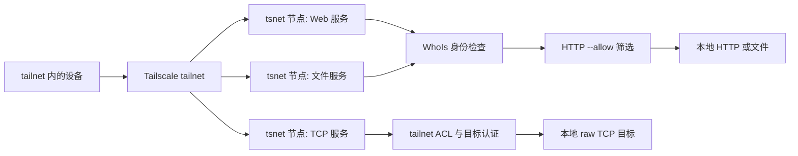

# TSLink

为本地 Web、文件或 TCP 服务创建独立的 Tailscale 节点和 tailnet 名称。

[
](LICENSE)
[
](go.mod)
[
](https://github.com/anydoor7/tslink)

[English](README.md) ·
[GitHub](https://github.com/anydoor7/tslink)

[为什么使用](#为什么使用-tslink) · [快速开始](#快速开始) · [功能](#功能) ·
[工作原理](#工作原理) · [安全模型](#安全模型) ·
[AI-agent](#面向-ai-agent) · [命令](#命令) · [文档](#文档)

## 为什么使用 TSLink

本地服务需要一个能从其他设备访问的地址。
路由器端口转发让服务通过公网被访问；托管隧道则让请求经过服务提供方。
Tailscale 提供设备间的私有连接，但为每个本地服务配置独立主机名和访问规则仍需操作。

| 方案 | 谁来配置 | 流量路径 | 每个服务的身份 | 每个服务的访问控制 |
|---|---|---|---|---|
| 端口转发 | 路由器管理员 | 公网到路由器 | 端口或域名映射 | 防火墙与应用 |
| [ngrok](https://ngrok.com/use-cases/share-localhost) | ngrok 账号持有人 | ngrok 云端与隧道 | Endpoint URL | Traffic Policy 或应用 |
| [Cloudflare Tunnel](https://developers.cloudflare.com/tunnel/concepts/routing/) | Cloudflare 账号与 connector 管理员 | Cloudflare 网络与隧道 | 已发布的主机名 | Cloudflare Access 或应用 |
| [Tailscale Services](https://tailscale.com/docs/features/tailscale-services) | tailnet 管理员；宿主需要审批或自动审批 | tailnet 直连或加密中继 | Service 名称 | tailnet grants 或 ACL |
| TSLink | 拥有 tailnet 账号的本机用户 | tailnet 直连或加密中继 | 每个服务一个 [tsnet](https://tailscale.com/docs/features/tsnet) 节点 | HTTP 使用 `--allow`；TCP 使用 tailnet ACL |

TSLink 通过 [tsnet](https://tailscale.com/docs/features/tsnet)
为每个服务建立节点。首次运行可以通过用户账号入网，无需保存管理员凭证。[Tailscale Services](https://tailscale.com/docs/features/tailscale-services)
适合由 tailnet 管理员集中定义、审批和管理服务的场景。

无法直连时，Tailscale 可能通过
[DERP 中继](https://tailscale.com/docs/reference/derp-servers)
传送已加密的 tailnet transport 流量。显式使用 `--funnel --public` 可以把 HTTP 代理开放到公网。

## 快速开始

目前还没有公开 tag，也没有可用的 Homebrew tap。现在请使用 Go 1.26.6
或更新版本从源码安装。二进制文件位于 `$(go env GOPATH)/bin`
；如有需要，请将该目录加入 `PATH`。

```bash
git clone https://github.com/anydoor7/tslink.git
cd tslink
go install .
tslink share ./build
tslink add myapp --proxy localhost:3000
```

首次运行 `share` 会打印入网授权 URL。完成授权后，如果服务 URL 仍待生成，可执行
`tslink url <name> --wait`。`add`
会注册命名服务，并在有可用监督器时启动后台服务。其他路径见[入门文档](docs/getting-started_zh.md)和[守护进程生命周期](docs/daemon-lifecycle_zh.md)。

## 功能

### 发布服务

- `share` 接受文件、目录、端口号或 `host:port`，并打印一个 URL。
- `add` 注册 HTTP 代理、文件目录和 raw TCP 服务，每个服务都有独立节点。
- HTTP 代理和文件服务使用 Tailscale HTTPS listener。TCP 转发私有字节流。
- Funnel 公网开放需要 `--funnel --public`；普通服务留在 tailnet 内。

### 访问控制

- `--allow` 根据 Tailscale 登录身份或标签筛选 HTTP 代理和文件请求。
- raw TCP 依赖 tailnet 策略和目标应用自身的认证。
- 每个服务都有独立节点、主机名和网络身份。
- `access explain`、`status --urls` 和 `doctor` 展示本地证据与未知的外部层。

### Agent 与 MCP

- `tslink mcp` 通过 stdio 向本机 MCP 客户端提供工具。
- 配置 `mcp.allow` 后，`tslink serve --mcp` 可通过专用 tailnet 节点提供同一组工具。
- `--json` 为 CLI 自动化提供带版本信息的结果结构。
- 内置模板可以先预览，再添加尚未注册的服务。

### 运行管理

- 守护进程运行时，注册表的变更会生效。
- `install` 在 macOS、Linux 或 Windows 设置用户级监督；重启行为因平台而异。
- Tier 1 让用户自有节点入网，无需保存凭证。Tier 2 支持有标签和凭证的安装。
- 本地诊断与清理命令会报告已检查的内容，再决定是否修改远端状态。

## 工作原理



每个注册服务都运行在独立的 tsnet 节点上。HTTP 代理和文件服务先进行 WhoIs 检查，再应用 `--allow`
名单。raw TCP 不经过 TSLink 的 HTTP
身份筛选；其保护来自 tailnet 策略和目标服务。详情见[架构文档](docs/architecture_zh.md)。

## 安全模型

TSLink 与常见零信任原则的对应关系：

| 零信任原则 | TSLink 实现 |
|-----------|------------|
| **HTTP 调用方验证** | tailnet 内的 HTTP 代理/文件请求可以通过 Tailscale WhoIs 认证。代理先移除客户端传来的 `Tailscale-*`、`X-Tailscale-*` 身份头及带下划线的变体；只有 WhoIs 成功，才注入 `X-Tailscale-User-Login`、`X-Tailscale-User-Name`、`X-Tailscale-User-Picture` 和 `X-Tailscale-Node`。公网 Funnel 和 raw TCP 不视为 TSLink 强制执行的 Tailscale 用户认证。 |
| **HTTP 最小权限访问** | `--allow` 限制 proxy 和 file 服务的访问用户或标签。TCP 服务依赖 Tailscale 网络 ACL 和标签。 |
| **假设已被攻破** | tailnet 设备之间的流量使用 WireGuard 加密。即使本地网络被攻破，Tailscale 设备之间的流量仍然加密；公网 Funnel 路径遵循 Tailscale Funnel 语义。 |
| **Per-service 网络身份** | 每个服务作为独立 tsnet 节点运行，拥有自己的主机名和网络身份。这是网络分段，不是 host process isolation 或合规背书。 |
| **消除隐式信任** | 默认不暴露任何服务到公网。首次运行默认走 Tailscale interactive enrollment：不存储管理员凭证、不 advertise tags、也不修改 ACL。可选的 durable-install 凭证优先存入系统钥匙串；macOS/Linux 的文件回退要求先证明没有残留的钥匙串凭证。 |

注册 proxy 和 TCP 服务时，TSLink 拒绝以字面地址写出的链路本地地址、未指定地址、
已知云元数据目标，以及被拒绝 IPv4 地址的数字变体。`127.1` 这样的 loopback 简写可以使用。
目标校验不解析 DNS，也不在连接时检查解析出的地址。

这是一份设计层面的对应关系，不是正式背书。TSLink 不声称任何合规状态；机器可读的能力清单是
[`internal/security/capabilities.v1.json`](./internal/security/capabilities.v1.json)
，其中每一条
capability 都显式记录了自己的合规状态。

## 面向 AI agent

本机 MCP 客户端可以启动已安装的命令：

```json
{
  "mcpServers": {
    "tslink": {
      "command": "tslink",
      "args": ["mcp"]
    }
  }
}
```

本机 MCP 进程不会打开网络监听。工具调用可以启动独立的 TSLink 守护进程来发布服务。其他 tailnet
设备上的客户端需要配置远程控制面和 `mcp.allow`；参阅[远程 MCP](docs/remote-mcp_zh.md)和[MCP 客户端配置](docs/mcp-clients.md)。

| | `tslink mcp` | `tslink serve --mcp` |
|---|---|---|
| 传输 | stdio，newline-delimited JSON-RPC | Streamable HTTP，地址 `<node>.<tailnet>.ts.net/mcp` |
| 网络 listener | 无 | 专用 tsnet 节点上的 TLS listener，仅限 tailnet |
| 授权 | 启动它的本机用户 | `mcp.allow` 中的登录邮箱和/或 `tag:` 条目，必填 |
| 配置 | 无 | `--mcp` 或 `mcp.enabled`，加上 `config.json` 中的 `mcp.allow` |
| Tools | 19 个 | 同一组 19 个，来自同一个 tool registry |
| 典型 client | 本机上的 MCP client | tailnet 内另一台机器上的 MCP client |

远程节点仅在 tailnet 内可访问。获授权的调用方能添加、移除服务，通过 Funnel
将代理开放到公网，并管理邀请。请按这些权限配置 `mcp.allow`。

## 命令

| 命令 | 描述 |
|------|------|
| `tslink login` | 存储可选的 Tier 2 API 访问令牌或 OAuth 客户端密钥 |
| `tslink logout` | 清除认证状态 |
| `tslink add <name> --proxy host:port` | 暴露本地 Web 服务 |
| `tslink add <name> --dir /path` | 暴露文件目录 |
| `tslink add <name> --tcp host:port` | 暴露 TCP 服务（数据库、SSH 等） |
| `tslink remove <name>` | 移除已注册的服务，并报告 protected/manual 远端清理指引 |
| `tslink list` | 列出本机已注册的服务 |
| `tslink list --tailnet` | 只读：列出整个 tailnet 中所有带 TSLink 标签的设备，包括其它机器的服务和孤儿节点（需要已存储的 API 凭证） |
| `tslink share <path\|port\|host:port>` | 分享一个本地路径或 Web 端口，并打印它的 tailnet URL |
| `tslink url <name>` | 打印某个服务的准确运行时 URL |
| `tslink cleanup` | 回收过期的 Funnel 暴露和 TSLink 拥有的资源；默认只预览，传 `--dry-run=false` 才实际执行；即使没有本地服务在用，也保留共享的 Funnel ACL grant |
| `tslink serve` | 启动网关（前台） |
| `tslink serve --daemon` | 启动网关（后台） |
| `tslink serve --mcp` | 启动网关，并在专用的仅限 tailnet 节点上提供远程 MCP 控制面（必须配置 `mcp.allow`） |
| `tslink stop` | 停止网关 |
| `tslink status` | 显示网关状态 |
| `tslink status --urls` | 显示 owner-only 服务 URL、暴露模式、allow 摘要、后端和 warning code |
| `tslink doctor` | 诊断凭证、daemon、注册表、runtime snapshot、暴露模式、目标安全性和 Tailscale SSH 开启状态；可能补写缺失的凭证 metadata |
| `tslink access explain <service>` | 解释某个服务的本地访问模型，以及仍属于外部策略/后端认证的部分 |
| `tslink logs` | 查看最近的网关日志 |
| `tslink template list` | 列出内置个人服务模板 |
| `tslink template show <name>` | 预览内置模板 |
| `tslink template apply <name> --yes` | 只添加缺失的模板服务，不覆盖已有服务；不加 `--yes` 或传 `--dry-run` 只预览 |
| `tslink tags list` | 列出所有服务及其标签 |
| `tslink tags pull` | 使用 API 访问令牌从 Tailscale ACL 拉取远端标签；OAuth-only 模式会跳过 |
| `tslink tags add <service> <tag>` | 为服务追加一个标签 |
| `tslink tags set <service> <tag>` | 替换服务的全部标签 |
| `tslink tags set-default <tag>` | 修改新服务的默认标签 |
| `tslink tags delete-remote <tag> --force --manage-acl` | 通过本地安全检查和显式远端写入 opt-in 后从 Tailscale ACL 全局移除 ACL 标签所有者规则 |
| `tslink invite user <email>` | 邀请一位用户加入 tailnet；需要 user-owned API 访问令牌 |
| `tslink invite device <service> <email>` | 把某个 TSLink 拥有的服务设备分享给外部用户；需要确切的节点归属证明 |
| `tslink invite list` | 列出未完成的用户邀请和 TSLink 拥有的设备邀请 |
| `tslink invite revoke <id> --kind <user\|device>` | 撤销一个用户或设备邀请 |
| `tslink invite resend <id> --kind <user\|device>` | 重新发送用户或设备的邮件邀请 |
| `tslink mcp` | 面向 agent 的本地 stdio MCP server；不开网络 listener，不需要 `mcp.allow` |
| `tslink config` | 管理全局配置，子命令为 set、get、list |
| `tslink manifest` | 打印每个命令、flag、退出码和 error code 的机器可读描述 |
| `tslink registry check [path]` | 严格校验一个 `registry.json`，不做任何修改 |
| `tslink install` | 开机自启（macOS LaunchAgent / Linux systemd / Windows 启动文件夹） |
| `tslink uninstall` | 移除自启 |

首次运行时，默认 registry 文件尚不存在是有效的空状态。显式传入不存在的
`registry check <path>` 会报 `not_found` （退出码 5）。registry JSON
语法、字段类型
或尾部数据有误时，会报 `usage_error`（退出码 2），并给出文件路径和修复指引。
`list`、`status` 和 `doctor` 会在健康服务旁显示有误条目；修改 registry 前应先修复或移除它。

[退出码与 `add` 标志](docs/cli-reference_zh.md) 另有说明。[生成的 CLI manifest](docs/cli-manifest.json)列出所有命令、标志、退出码和错误码。

## 文档

| 文档 | 内容 |
|---|---|
| [入门](docs/getting-started_zh.md) | 安装、首次分享、示例 |
| [分享](docs/sharing_zh.md) | 文件、目录和端口分享的边界 |
| [守护进程生命周期](docs/daemon-lifecycle_zh.md) | 监督、自启动、升级、回滚 |
| [凭证与标签](docs/credentials-and-tags_zh.md) | Tier 1、Tier 2、登录、标签操作 |
| [平台支持](docs/platforms_zh.md) | 前置条件、状态目录、各系统行为 |
| [跨机器操作](docs/multi-machine_zh.md) | `list --tailnet` 与 Tailscale SSH |
| [远程 MCP](docs/remote-mcp_zh.md) | tailnet 控制面与授权 |
| [MCP 客户端](docs/mcp-clients.md) | 客户端配置与事件流 |
| [JSON 自动化](docs/json-automation_zh.md) | 版本化结果与命令示例 |
| [CLI 参考](docs/cli-reference_zh.md) | 命令细节、退出码、标志 |
| [架构](docs/architecture_zh.md) | tsnet 节点与注册表行为 |
| [发布产物](docs/release-artifacts_zh.md) | 计划中的产物与安装方式 |
| [验证发布](docs/verify-release_zh.md) | 校验和、Sigstore、SBOM、attestation |
| [路线图](docs/roadmap_zh.md) | 尚未实现或验证的功能 |
| [方案背景](docs/landscape_zh.md) | Tailscale Services 与其他路径 |

## 贡献

开发检查和贡献者权利见 [CONTRIBUTING.md](CONTRIBUTING.md) 。Issue 与 pull
request 请使用
[GitHub 仓库](https://github.com/anydoor7/tslink) 。

## 安全

安全边界和私密漏洞报告方式见 [SECURITY.md](SECURITY.md) 。安全问题请通过
[GitHub 私密漏洞报告](https://github.com/anydoor7/tslink/security/advisories/new)
提交。

## 许可证

TSLink 使用未经修改的 [Apache License 2.0](LICENSE)
。任何规模的个人或组织均可按该许可用于商业用途。[商业合作](COMMERCIAL_zh.md)完全自愿，不增加软件许可条件。分发时保留适用的
[NOTICE](NOTICE)
和[第三方声明](THIRD_PARTY_NOTICES.md)。Tailscale 的服务使用权和套餐另受其条款约束。

Copyright 2026 anydoor7
