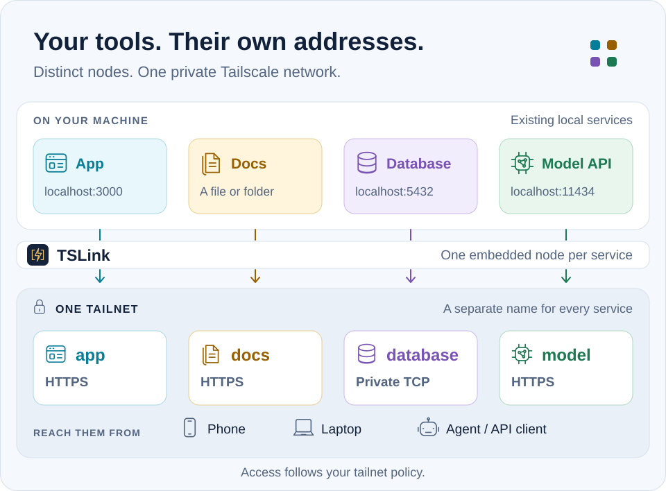

<p align="center">
  <picture>
    <source media="(prefers-color-scheme: dark)" srcset="assets/tslink-mark-dark.svg">
    
  </picture>
</p>
<h1 align="center">TSLink</h1>
<p align="center"><strong>你的应用，在你的 Tailscale 网络里有私有地址。</strong></p>
<p align="center">用自己的设备打开。想分享时，可以给某个人或一个链接，有效期到你选的日期。</p>
<p align="center"><a href="../README.md">English</a> · <strong>简体中文</strong> · <a href="README.ja.md">日本語</a> · <a href="README.ko.md">한국어</a> · <a href="README.es.md">Español</a> · <a href="INDEX.md#translated-homepages">更多语言</a></p>

```sh
tslink share 3000 --name notes       # a web app → https://notes.<your-tailnet>.ts.net
tslink share ./photos                # a folder or a single file
tslink add db --tcp localhost:5432   # any TCP port
```

<a id="installation"></a>
<a id="quickstart"></a>

## 安装

```sh
brew install --cask anydoor7/tap/tslink
```

Linux 的 `.deb`、`.rpm` 安装包和 Windows 版本在[最新发布](https://github.com/anydoor7/tslink/releases/latest)页面。第一次分享应用时，TSLink 会给出这个应用的 Tailscale 登录链接。[上手指南](getting-started.md)

<a id="use-cases"></a>

## 你的应用，在自己的设备上打开

- **每个应用一个地址。** Web 应用、文件夹、单个文件和 TCP 端口在你的 tailnet 里各有自己的名字，按名字打开就行，不用记 IP 地址和端口。
- **默认私有。** 只有在你创建访客链接或通过 Funnel 发布之后，才会有公开入口。
- **一个入口页**，列出你的应用和它们的健康状态。[入口页](portal.md)
- **健康检查与告警**，通过命令或 webhook 通知；访问记录也包括遭到拒绝的请求。[健康检查与告警](health-and-alerts.md) · [访问记录](access-log.md)
- **15 个自托管应用的配方**，包括 Home Assistant、Jellyfin、Immich 和 Ollama。`tslink apps detect` 会找出已经在运行的那些。[应用配方](apps.md)

## 想分享时再分享

```sh
tslink people add alice@example.com --apps notes --for 7d   # a tailnet member, for 7 days
tslink guest create notes --for 3d --public --print-link    # a browser link, no Tailscale needed
tslink add launch --proxy localhost:4000 --funnel --public --funnel-ttl 1h   # anyone, for one hour
```

访客链接和公网 URL 一定会过期，而且只适用于 Web 应用；文件夹、文件和 TCP 端口始终保持私有。[人员授权](people.md) · [访客链接](guest-links.md) · [公网访问](funnel.md)

<a id="agents"></a>

## 面向 AI 智能体

智能体在 `localhost` 上启动的开发服务器，你的手机访问不到。有了 TSLink，智能体可以在你选定的角色范围内给它一个私有地址，报告准确的 URL，用完再移除。

```json
{"mcpServers":{"tslink":{"command":"tslink","args":["mcp"]}}}
```

- **CLI 或 MCP。** 管理命令支持 `--json`，返回带版本号的结果；`tslink mcp` 通过 MCP 提供同样的操作。
- **有限的角色。** `viewer`、`app-operator` 或 `people-manager`，只能管理你指定的应用。`tslink mcp-audit` 显示智能体改了什么。角色只限制 TSLink 的工具，管不到智能体自己的 shell。

[智能体快速开始](agent-quickstart.md) · [MCP 权限](mcp-scopes.md) · [远程 MCP](remote-mcp.md)

<a id="architecture"></a>

## 它如何工作

<picture>
  <source media="(max-width: 600px) and (prefers-color-scheme: dark)" srcset="assets/service-map-dark-mobile.svg">
  <source media="(max-width: 600px)" srcset="assets/service-map-light-mobile.svg">
  <source media="(prefers-color-scheme: dark)" srcset="assets/service-map-dark.svg">
  
</picture>

一个后台进程为每个应用运行独立的 Tailscale 节点。Tailscale 提供 tailnet 传输和 HTTPS 证书。私有的 Web 和文件访问可以用 `--allow` 和人员授权按 Tailscale 身份限制；原始 TCP 依靠你的 tailnet 策略和应用自己的登录。[架构](architecture.md)

<a id="requirements"></a>

## 使用要求

| 谁 | 需要什么 |
|---|---|
| 你 | 一个开启了 MagicDNS 和 HTTPS 的 Tailscale 账户 |
| 运行应用的机器 | 只要 TSLink，它内置了 Tailscale |
| 你的设备，以及你分享的对象 | Tailscale 客户端 |
| 访客 | 浏览器 |

应用名称会出现在公开的证书日志里，请选你不介意别人看到的名字。

<a id="documentation"></a>

## 更多

[全部文档](INDEX.md) · [CLI 参考](cli-reference.md) · [与 Serve、ngrok 和 Cloudflare 的对比](comparison.md) · [贡献](../CONTRIBUTING.md) · [安全](../SECURITY.md)

Apache 2.0。TSLink 是独立项目，不由 Tailscale 开发，也未获 Tailscale 认可。
