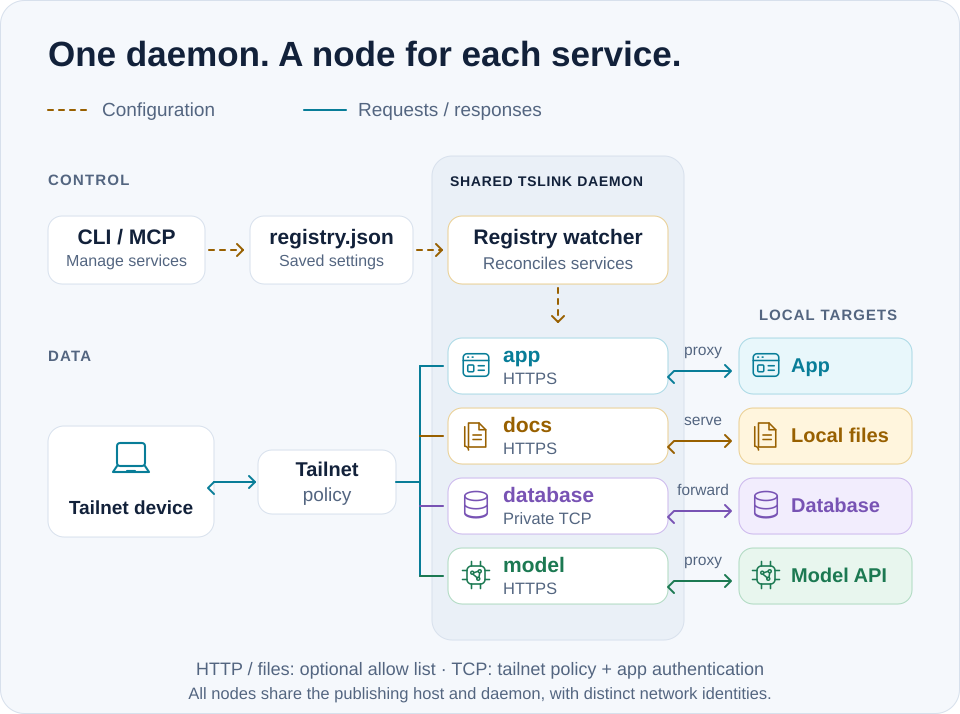

# Architecture

TSLink runs one shared daemon on the publishing machine, with a dedicated
[tsnet](https://tailscale.com/kb/1244/tsnet) node for each registered service.
Each node has its own network identity and hostname. The publishing machine
does not need a separate Tailscale client installation.

## Configuration and request paths

<picture>
  <source media="(max-width: 600px) and (prefers-color-scheme: dark)" srcset="assets/system-architecture-dark-mobile.svg">
  <source media="(max-width: 600px)" srcset="assets/system-architecture-light-mobile.svg">
  <source media="(prefers-color-scheme: dark)" srcset="assets/system-architecture-dark.svg">
  
</picture>

Dashed arrows show configuration changes; solid arrows show requests and
responses. This illustrates ordinary private services in the same tailnet.
The targets shown are local examples; public Funnel is not shown.

1. **Configure.** CLI and MCP service-management operations persist service
   settings in `~/.config/tslink/registry.json`. The file survives restarts.
2. **Reconcile.** The shared daemon watches the registry and applies changes
   to its embedded nodes without a daemon restart. Each service has its
   own node identity; a fresh node must complete Tailscale enrollment.
3. **Connect.** A permitted tailnet device reaches the selected node. An HTTP
   proxy forwards to an existing app or model API; a file service reads the
   configured files directly; a TCP service forwards bytes to its target.

The nodes share a process and publishing host. Separate network identities
allow separate tailnet rules; they do not isolate host processes or data.
A model endpoint is an ordinary HTTP proxy target. The application handles
model inference and any document processing, as shown in [Local AI](local-ai.md).

## Access and identity

- **Tailnet policy** governs which devices can reach each node. HTTP proxy
  and file nodes use Tailscale HTTPS listeners. Raw TCP uses private tailnet
  transport; it is not an HTTPS listener.
- **Optional HTTP allow lists:** with `--allow`, WhoIs must succeed and the
  caller must match, or the HTTP proxy/file request receives 403 before the
  backend or file handler. Without a list, tailnet policy governs reachability;
  WhoIs-derived identity headers and logs are best effort.
- **Identity headers:** the proxy strips client-supplied Tailscale identity
  headers, including underscore variants, even if WhoIs fails. Public Funnel
  callers are not treated as TSLink-enforced Tailscale user identities.
- **Raw TCP** has no HTTP WhoIs/allow-list layer. Use tailnet policy and the
  target application's authentication.

MCP is a management interface, not a hop in ordinary service requests. Local
MCP uses stdio; optional [remote MCP](remote-mcp.md) has its own dedicated
node and explicit caller configuration.

## Operational details

- Credentials use the system keychain. On macOS/Linux, restricted-permission
  file fallback succeeds only after stale keychain authority is proven absent
  or cleared.
- Daemon lifecycle uses PID and process-identity checks, with platform-specific
  stop behavior. See [daemon lifecycle](daemon-lifecycle.md).
- Structured logging uses `slog`, including access logs.
