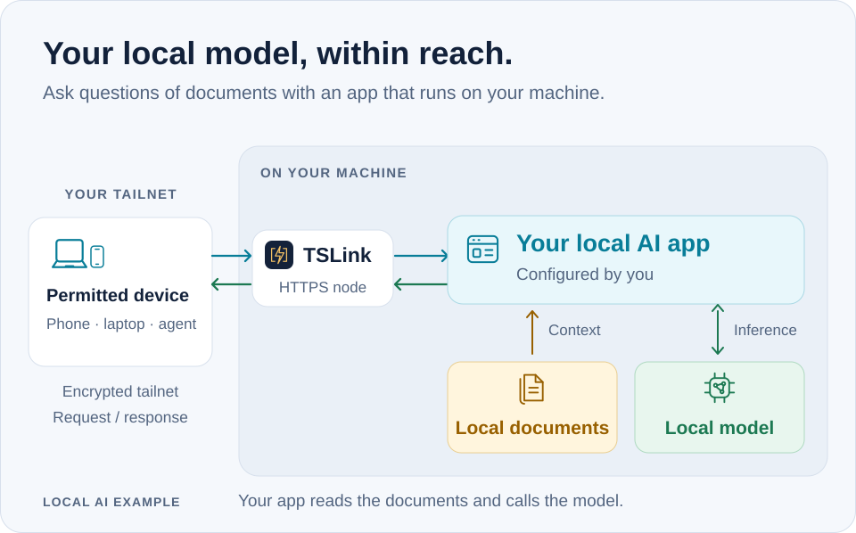

# 本地模型与私有数据工作流

[English](local-ai.md) · [简体中文](local-ai_zh.md) · [README](README.zh-CN.md)

TSLink 可以为已经运行的本地模型 HTTP API 提供一个 Tailscale 网络内的命名 HTTPS 地址。
获准设备上的应用或 agent 就能通过这个地址调用 API。模型后端执行推理，TSLink 转发 HTTP 流量。

## 开始之前

- 完成 [TSLink 安装与 tailnet 设置](getting-started_zh.md)。发布端需要可用的 TSLink 守护进程，
  接收设备需要登录 Tailscale，并获准访问新服务。按提示授权新节点；网络可能还要求设备审批。
- 在发布端单独运行 Ollama，监听 `localhost:11434`。希望在本机推理时，选择已下载的本地模型。
  Ollama 也可以使用云端模型。
- Shell 示例使用 **bash 或 zsh**，并需要 `curl`。Windows 要求见[平台支持](platforms_zh.md)。

## 1. 在本机检查现有 API

在运行 Ollama 的机器上执行：

```bash
curl http://localhost:11434/api/tags
```

这个 [Ollama 接口](https://docs.ollama.com/api/tags)列出可用模型。
返回空列表时，需要先安装模型才能请求本地推理。若本机 API 无法连接，先启动或修复后端，再注册 TSLink 服务。

## 2. 注册模型服务

```bash
tslink add model --proxy localhost:11434
tslink url model --wait
```

按提示完成 Tailscale 节点授权。使用返回的准确 HTTPS URL，无需自行拼接主机名。
`add` 默认建立持久节点。

若希望仅允许自己的 Tailscale 登录身份访问这个 HTTP API，将下面的邮箱替换为实际登录邮箱，
用这个注册命令替代上面的 `add`：

```bash
tslink add model --proxy localhost:11434 --allow you@example.com
```

tailnet 策略也需要允许连接。同名 `add` 会替换全部服务设置，修改时请重复传入需要保留的 flags。
普通模型服务仅在私网提供访问；这个私有数据工作流应保持 Funnel 关闭。

## 3. 从获准设备连接

在接收设备上，将占位符换成 TSLink 输出的 URL：

```bash
MODEL_URL='PASTE_THE_EXACT_URL_RETURNED_BY_TSLINK'
curl "$MODEL_URL/api/tags"
```

客户端也使用这个地址。下面是**配置格式**，不是已经上线的 URL：

| 客户端 / API | 应配置的地址 | 请求路径 |
|---|---|---|
| 要求填写服务地址的 Ollama 客户端 | `<返回的 URL>` | 客户端选择 `/api/...` 路径 |
| 要求填写 API base 的原生 Ollama API 客户端 | `<返回的 URL>/api` | `/chat`、`/generate`、`/tags` |
| 要求填写 `baseURL` 的 OpenAI API 兼容客户端 | `<返回的 URL>/v1` | `/chat/completions` |

选择后端上可用的模型名称。Ollama [兼容部分 OpenAI API](https://docs.ollama.com/api/openai-compatibility)，
请核对客户端使用的路径和选项。本地 Ollama 请求无需 Ollama API key；
客户端要求填写的 key 字段也不能替代 Tailscale 的访问控制。

发送原生聊天请求时，先将下面的模型占位符换成已安装的本地模型：

```bash
curl "$MODEL_URL/api/chat" \
  -H 'Content-Type: application/json' \
  -d '{"model":"REPLACE_WITH_INSTALLED_LOCAL_MODEL","messages":[{"role":"user","content":"Reply with one short greeting."}],"stream":false}'
```

这条小请求可以先检查推理路径，无需提交私有数据。
Ollama 原生 API 支持[以换行分隔的 JSON 流](https://docs.ollama.com/api/streaming)；
示例关闭流式输出，便于阅读完整响应。

<a id="pair-a-model-api-with-a-web-ui"></a>

## 将模型 API 与 Web 界面配成一组

这条模板路线可替代上面的手动注册：同一个模型 API 在模板中命名为 `ollama`，手动例子命名为 `model`。
选择一条路线即可，避免为同一后端额外建立节点。

内置 `local-ai-suite` 模板配置两个独立的 TSLink 服务节点：

| 服务名称 | HTTP 后端 | 用途 |
|---|---|---|
| `ollama` | `localhost:11434` | 模型 API |
| `open-webui` | `localhost:8080` | 浏览器应用 |

两个应用需要分别安装、配置和启动。按部署方式配置 Open WebUI 的模型连接；模板只注册访问路径。

先预览计划：

```bash
tslink template apply local-ai-suite
```

检查后再注册缺失的服务：

```bash
tslink template apply local-ai-suite --yes
tslink url ollama --wait
tslink url open-webui --wait
```

模板保留已有服务条目。另外还有 `local-web` 和 `dev-suite`；
`tslink template list` 可以查看内置模板。

## 一个实用的私有数据部署

<picture>
  <source media="(max-width: 600px) and (prefers-color-scheme: dark)" srcset="assets/local-ai-flow-dark-mobile.svg">
  <source media="(max-width: 600px)" srcset="assets/local-ai-flow-light-mobile.svg">
  <source media="(prefers-color-scheme: dark)" srcset="assets/local-ai-flow-dark.svg">
  
</picture>

让获准设备通过 **App** 节点访问本地应用。应用读取本地文档或数据库，再调用发布端已下载的模型。
需要直接访问时，也可以为 **Docs**、**Database** 和 **Model** 分别建立命名节点。
这些节点位于同一个 tailnet，每个服务都有自己的网络身份。

应用负责文档加载、embedding、检索和 RAG。选择本地模型与本地数据存储，可以让这些操作在自己的主机上完成。
根据数据敏感程度配置模型选择、客户端与后端日志、外部工具和对外请求；
监听 localhost 的 API 仍可能使用云端模型。

TSLink 的 MCP 地址提供管理服务与分享的工具。Agent 的推理连接需另外配置，使用上面的模型 API 地址。
远程或云端 agent 也需要连入 tailnet 的路径，并可能在它们自己的主机上处理收到的数据。

## HTTP 行为与运行

代理将请求路径与正文转发给后端，并支持流式响应刷新。
它会重写转发信息与 Tailscale 身份 headers，过滤 hop-by-hop headers。
模型协议的兼容性由后端与客户端决定。

服务器默认限制为：请求正文 **32 MiB**、headers **64 KiB**、请求读取超时 **30 秒**。
大型上传需要满足这些限制，生成行为也受后端与客户端影响。
TSLink、模型与应用进程都需持续运行，详情见[守护进程生命周期](daemon-lifecycle_zh.md)。

可用 `tslink status --urls --json` 和 `tslink doctor --json` 检查地址与设置。
按服务身份限制访问及 TCP 边界见[分享文档](sharing_zh.md)。

API 一手资料：[Ollama API introduction](https://docs.ollama.com/api/introduction)。
